# SemiErgo Layout
A proposal of ergonomic key layout for standard size keyboard

## 1. Specification
### 1-1. Basic physical layout
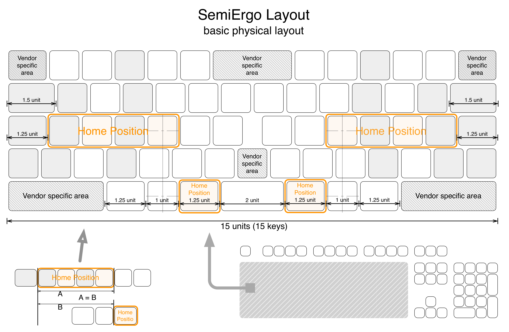
### 1-2. Narrow-type physical layout
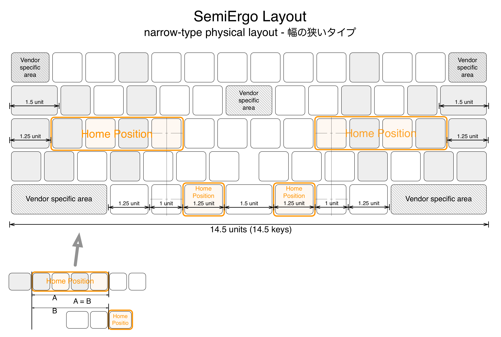
### 1-3. Wide-type physical layout
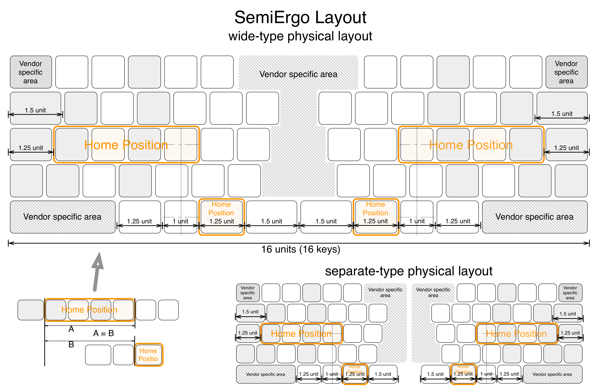

## 2. Description
### 2-1. Same Size
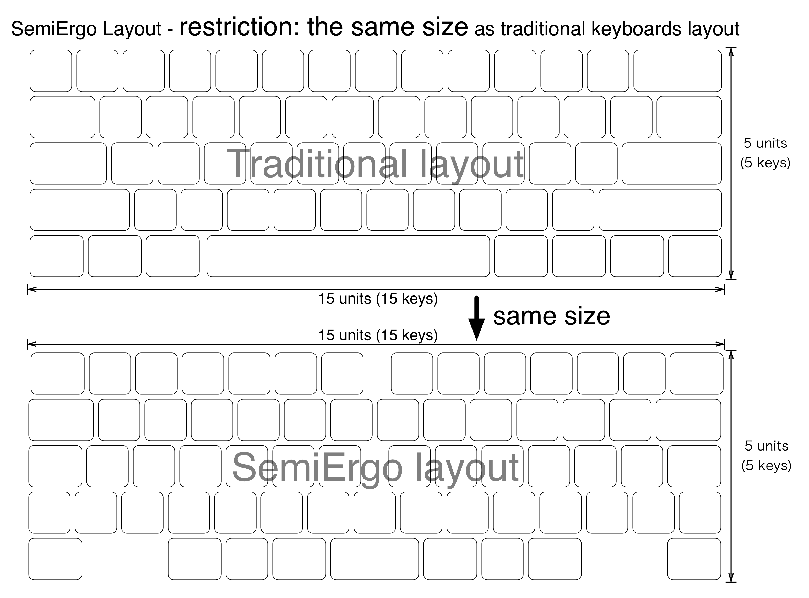
### 2-2. Symmetric
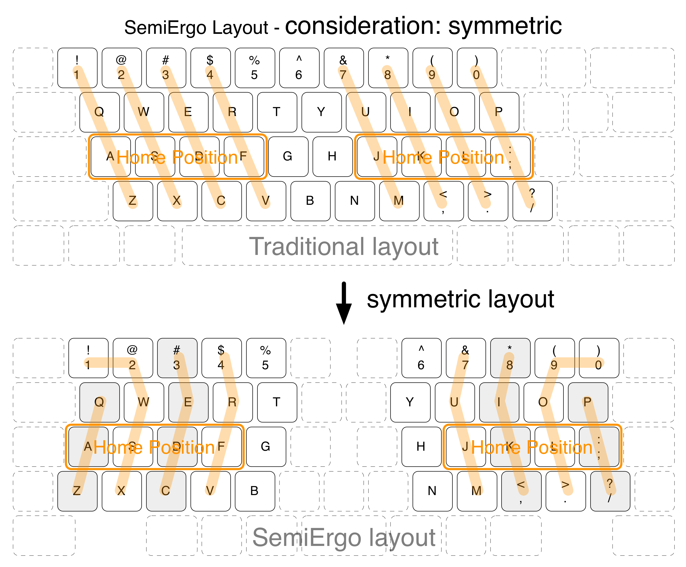
### 2-3. Rebalance
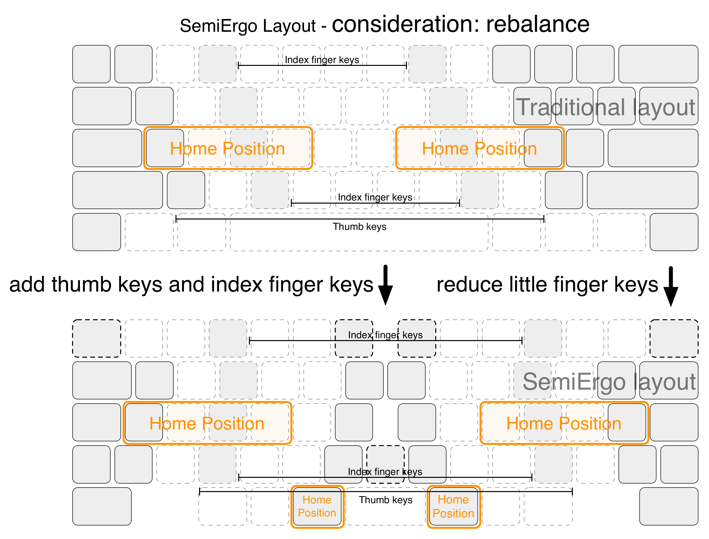

*****
## Appendix A. Mapping example
### A-1. Common mapping
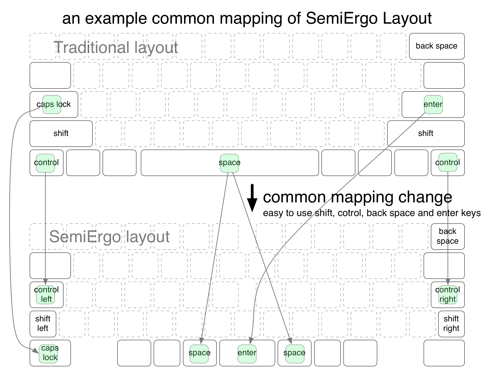
### A-2. US mapping
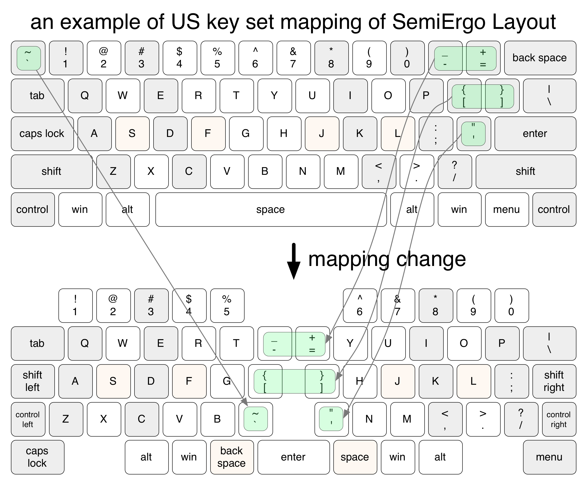
### A-3. Japanese mapping
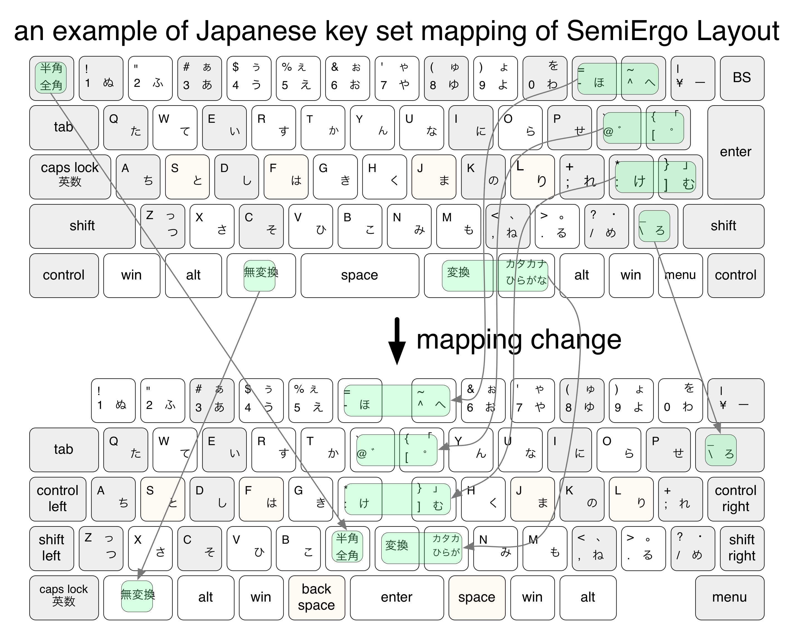

*****
## Appendix B. Draft Mappings for Windows
### B-1. Draft of Windows 104 US key set mapping
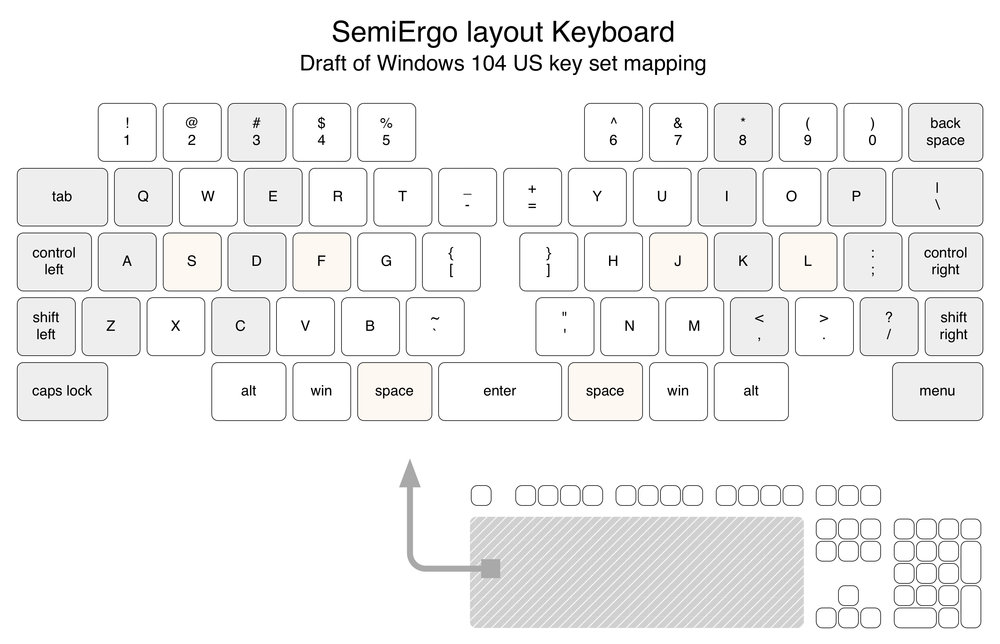
### B-2. Draft of Windows 109 Japanese key set mapping
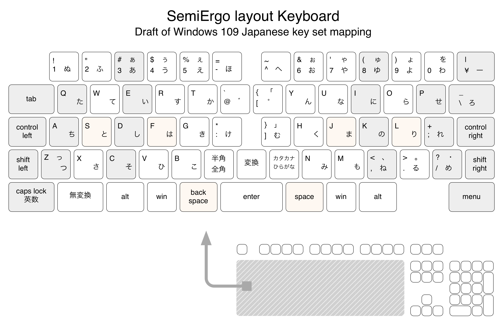

*****
## Appendix C. Draft Mappings for Mac
### C-1. Draft of MacBook/iMac US key set mapping
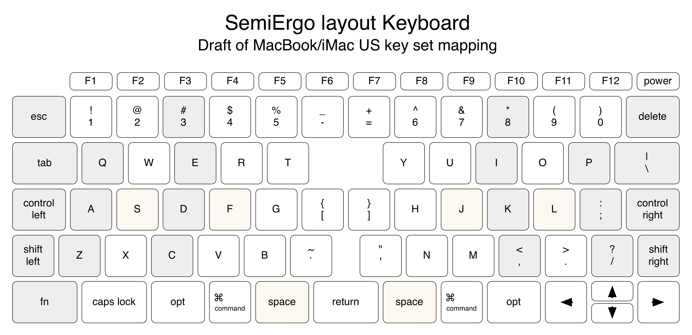
### C-2. Draft of MacBook/iMac US-Dvorak key set mapping
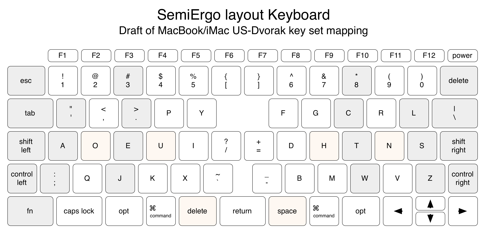
### C-3. Draft of MacBook/iMac Japanese key set mapping
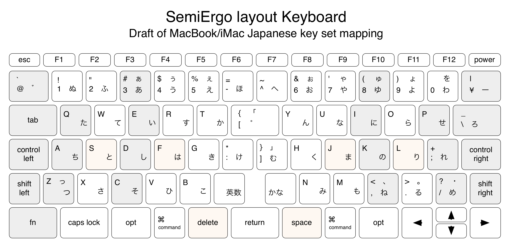
